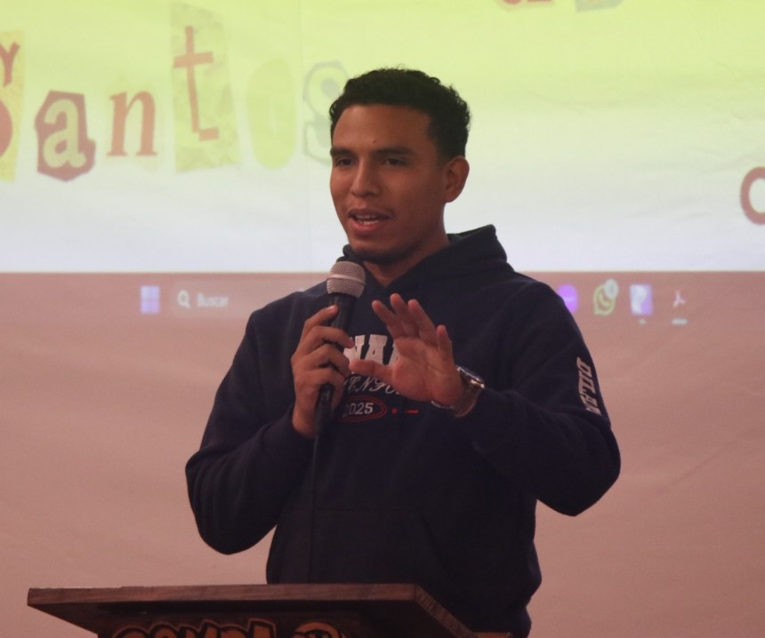

## Información del Proyecto

Este blog fue desarrollado como parte del proyecto final para la asignatura de Sistemas Operativos.

### Integrantes

| Foto | Nombre |
| :---: | :--- |
|  | Valeria Agrazal |
|  | Javier Cuello |
|  | Dilam Jimenez |
|  | Anel Ruiz |

### Profesor

*   Isaac Esquivel

### Institución

*   **Universidad:** Universidad Tecnológica de Panamá
*   **Facultad:** Facultad de Ingeniería de Sistemas Computacionales
*   **Departamento:** Departamento de Arquitectura y Redes de Computadoras
*   **Carrera:** Licenciatura en Ingenieria de Software
*   **Grupo:** Grupo 8
